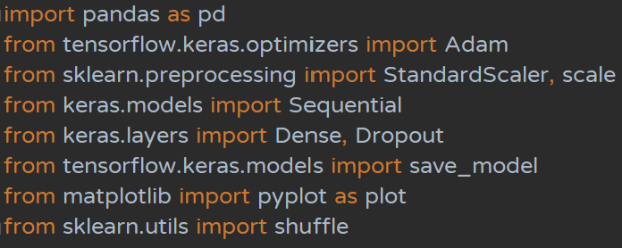

# NTUT 機器學習 Kaggle房價預測
---
## Step0. Import需要用到的套件
本專案用到的套件如下
|套件名稱|套件用途|
|---|---|
|keras & tensorflow|用來建立、訓練模型及預測輸出|
|pandas|用來處理外部資料，本專案中主要用來處理csv之讀取|
|sklearn|用來處理資料，本專案中用以資料前處理|
|matplotlib|用來繪製圖形，能更清楚顯示模型訓練的成果|
<div align='center'>

</div>

```python
# import Essentials
import pandas as pd  # 用來處理資料，本專案用於處理csv的讀取及篩選
from tensorflow.keras.optimizers import Adam  # Adam Optimizer
from sklearn.preprocessing import StandardScaler, scale  # 用以進行資料標準化
from keras.models import Sequential  # 可將各層模型連接起來
from keras.layers import Dense, Dropout  # 用於Hidden Layer 內
from tensorflow.keras.models import save_model  # 可將訓練後的模型儲存 
from matplotlib import pyplot as plot  # 可將訓練結果可視化，方便觀察模型表現
from sklearn.utils import shuffle  # 用以將讀入的csv內容打亂
```

## Step1. 讀取資料
首先使用pandas的read_csv方法
