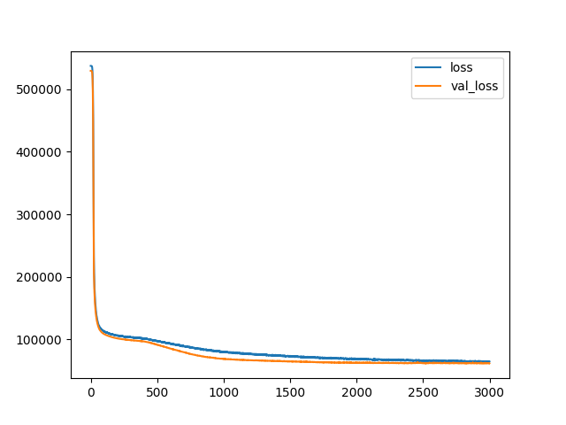
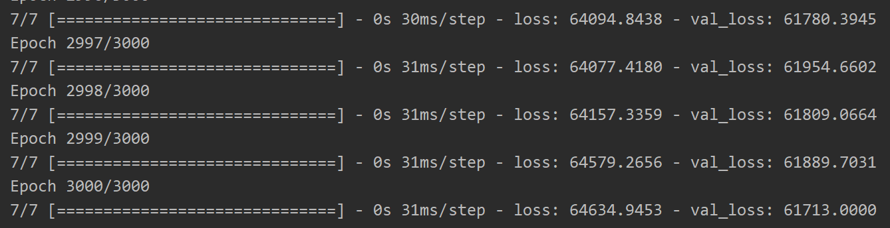
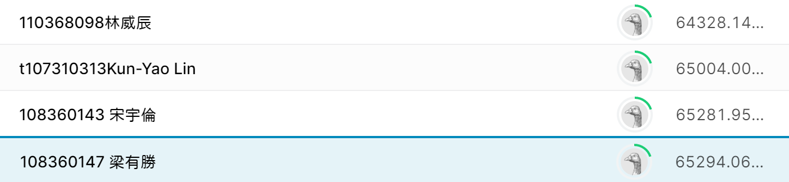

# NTUT 機器學習 Kaggle房價預測
---
## Step 0. Import需要用到的套件
##### 本專案用到的套件如下
|套件名稱|套件用途|
|:---:|---|
|keras & tensorflow|用來建立、訓練模型及預測輸出|
|pandas|用來處理外部資料，本專案中主要用來處理csv之讀取|
|sklearn|用來處理資料，本專案中用以資料前處理|
|matplotlib|用來繪製圖形，能更清楚顯示模型訓練的成果|

##### 此部分程式碼如下
```python
# import Essentials
import pandas as pd  # 用來處理資料，本專案用於處理csv的讀取及篩選
from tensorflow.keras.optimizers import Adam  # Adam Optimizer
from sklearn.preprocessing import StandardScaler, scale  # 用以進行資料標準化
from keras.models import Sequential  # 可將各層模型連接起來
from keras.layers import Dense, Dropout  # 用於Hidden Layer 內
from tensorflow.keras.models import save_model  # 可將訓練後的模型儲存 
from matplotlib import pyplot as plot  # 可將訓練結果可視化，方便觀察模型表現
from sklearn.utils import shuffle  # 用以將讀入的csv內容打亂
```

## Step 1. 讀取資料
* train data & valid data <br/>
首先使用`pandas`的`read_csv`方法將csv檔讀入變數 <br/>
再使用`sklearn.utils`的`shuffle`方法將輸入打亂 <br/>
之後使用`pandas`的`drop`將不需用到的欄位丟棄掉成為input <br/>
將price欄位另存入變數作為target <br/>

* test data <br/>
首先使用`pandas`的`read_csv`方法將csv檔讀入變數 <br/>
之後使用`pandas`的`drop`將id欄位丟棄成為input <br/>

##### 此部分程式碼如下
```python
# Load Dataset
train_path = "dataset/ntut-ml-regression-2021/train-v3.csv "  # Train Dataset的path
train_file = pd.read_csv(train_path)  # 將csv檔內容讀入變數
train_file = shuffle(train_file)  # 將輸入打亂，以便獲得更好訓練效果

valid_path = "dataset/ntut-ml-regression-2021/valid-v3.csv"   # Valid Dataset的path
valid_file = pd.read_csv(valid_path)  # 將csv檔內容讀入變數

test_path = "dataset/ntut-ml-regression-2021/test-v3.csv"      # Test Dataset的path
test_file = pd.read_csv(test_path)    # 將csv檔內容讀入變數

# Split Dataset into input part and target part
x_train = train_file.drop(["id", "price"], axis=1).values  # 丟棄id及price欄位
y_train = train_file.price.values  # 將price欄位的值存入變數做為traget

x_valid = valid_file.drop(["id", "price"], axis=1).values  # 丟棄id及price欄位
y_valid = valid_file.price.values  # 將price欄位的值存入變數做為traget

x_test = test_file.drop(["id"], axis=1).values  # 丟棄id欄位
```

## Step 2. 資料前處理
由於我是第一次參加這種競賽，對於資料前處理的經驗不足 <br/>
因此我並沒有用到太多技巧，純粹只是對輸入資料做標準化
##### 資料標準化
1. 使用`sklearn.preprocessing`的`StandardScaler`功能將`x_train`取標準化，並取得標準化的參數
2. 利用標準化的參數將`x_valid`和`x_test`也做標準化
##### 此部分程式碼如下
``` python
# Scale Data
scaler = StandardScaler().fit(x_train)
x_train = scale(x_train)
x_valid = scaler.transform(x_valid)
x_test = scaler.transform(x_test)
```
## Step 3. 建立模型
這個步驟花費我最長時間，不停的尋找最佳組合<br/>
一開始我設定的神經元數量很大，訓練出來的結果一直都是overfitting<br/>
後來我試著將神經元個數減少，發現overfitting問題解決，但收斂很慢<br/>
因此我將epoches調高，讓模型有更多時間去收斂，但發現收斂上限依然不足<br/>
於是最後我將神經元數量再次拉高，並且在較大層數的hidden layer間放入dropout<br/>
最終結果雖然好了很多，沒有overfitting，loss也降了不少，但我覺得應該能夠再調得更好<br/>
但由於上傳次數限制無法每次調整都看到結果，增加了參數調整的難度

##### 此部分程式碼如下
```python
# Create Model
myModel = Sequential()  # Sequential會自動將各層連接起來
# 加入神經元個數為500的Dense層，並設定輸入的shape。由於Sequential會自動連接，故後面的都不需設定shape
myModel.add(Dense(500, input_dim=x_train.shape[1], activation="relu", kernel_initializer="normal"))
# 加入25%的Dropout
myModel.add(Dropout(0.25))
# 加入神經元個數為400的Dense層
myModel.add(Dense(400, activation="relu", kernel_initializer="normal"))
# 加入20%的Dropout
myModel.add(Dropout(0.2))
# 加入神經元個數為150的Dense層
myModel.add(Dense(150, activation="relu", kernel_initializer="normal"))
# 加入20%的Dropout
myModel.add(Dropout(0.2))
# 加入神經元個數為50的Dense層
myModel.add(Dense(50, activation="relu", kernel_initializer="normal"))
# 加入神經元個數為20的Dense層
myModel.add(Dense(20, activation="relu", kernel_initializer="normal"))
# 建立output layer
myModel.add(Dense(1, activation='linear'))
# 設定Adam的learning_rate為0.0004
opt = Adam(learning_rate=0.0004)
myModel.compile(optimizer=opt, loss="MAE")
```
## Step 4. 訓練模型
使用`keras`的好處就是訓練模型很簡單，只需要下`model.fit`指令即可<br/>
##### 此部分程式碼如下
```python
# Setting Hyper parameters
epoches = 3000
batch_size = 2048

# Start Training Model
myModel.fit(x_train, y_train,batch_size=batch_size, epochs=epoches, validation_data=(x_valid, y_valid))
history = pd.DataFrame(myModel.history.history)  # 將訓練結果存入變數
plot.plot(history)  # 繪出訓練結果(loss和val_loss)
plot.legend(["loss", "val_loss"])
plot.show()
```

## Step 5. 儲存模型
這步驟也是很簡單，使用`keras`的`save_model`方法即可
##### 此部分程式碼如下
```python
# Save the Model
save_model(myModel, "myModel.h5")
```
## Step 6. 載入模型
使用`keras`的`load_model`方法可以將剛才儲存的模型讀入變數中
##### 此部分程式碼如下
```python
# Load Model
myModel = load_model("myModel.h5")
```
## Step 7. 預測結果並輸出為csv檔
預測結果的部分使用`model.predict`方法即可<br/>
而輸出至csv檔的方法，我使用迴圈寫入id及對應之price
##### 此部分程式碼如下
```python
# Predict the Result and Save
y_test = myModel.predict(x_test)

with open("result.csv", "w", newline="") as result :
    writer = csv.writer(result)
    writer.writerow(["id", "price"])

    for i in range(y_test.shape[0]):
        writer.writerow([(i+1), y_test[i][0]])
```
## 最終結果
##### 本專案最終訓練結果如下圖
###### loss、val_loss曲線圖
<div align="center">

</div>
###### loss、val_loss之最終值
<div align="center">

</div>
###### Kaggle成績-第四名
<div align="center">

</div>
---
## 心得
我第一次參加這樣子的競賽，很好玩<br/>
但也因為經驗不足導致很多地方做得不夠好<br/>
像是資料的前處理，我就沒有下太多的功夫<br/>
還有模型參數的調整，也是因為經驗不足才調很久<br/>
這次的比賽讓我獲得不少經驗，希望下次再比的時候能夠活用所得，拿取更好的成績！
